<p align="center">
  <a href="https://github.com/ishanjainn/superopen"></a>

  <a href="https://github.com/ishanjainn/superopen"></a>
</p>

Superopen is not another coding agent. It builds the open source harness around
Claude Code, Cursor, Codex, and similar agents so every coding session improves
the next with less token waste and lower cost.

- **The harness watches, the graph answers.** Hooks capture each session while a
  local Tree-sitter graph lets the agent query a scoped subgraph instead of
  grepping file by file -> **fewer input tokens**
- **Sessions become memory.** What one session learns is distilled into the same
  SQLite store the graph lives in; the next session starts from a **≤350-token**
  injected index instead of re-discovering your codebase.
- **Memory compounds, cost drops.** Follow-up sessions skip redundant
  exploration and re-explanation -> **lower cost per task**

## Getting Started

```bash
brew install ishanjainn/superopen/so   
so install                        
```

Then, in your Repository:

```bash
so init         # or /so init in the agent chat          
```

That's it. You get a `.so/` in that tree.

```text
.so/
  sessions/     # session events, transcripts, checkpoints
  db/so.db      # SQLite store: Graph + Memory
  .gitignore
```

From here
1. coding agents steer themselves: structural questions go straight to the **graph** to reduce tokens spent in grepping.
2. Hooks record every session in the background, finalizing transcripts into a session map plus relevant memory. 
3. At session end, harvest proposes small
improvements to your instruction files; nothing lands until you approve.

```bash
so graph build
so graph refresh              # skip when unchanged, or when .so/ is missing; --force for full rebuild
so graph search DataFlowingGate
so graph query "How does DataFlowingGate gate the UI?"
so graph architecture
so graph impact DataFlowingGate
```

Session hooks refresh the graph in the background on SessionStart / SessionEnd
(detached, fail-open) **only if the workspace already has `.so/`**. Builds are **local** (Tree-sitter + SQLite) — they do not
invoke an LLM or the live coding agent.

Default `so graph query` stdout is compact NODE/EDGE text plus `help[]` next steps. `--json` and `--full` are script escape hatches. That compact graph format is intentional; memory/sessions use AXI TOON instead.

## Layout summary

| Location | Purpose |
|----------|---------|
| User skill dirs | `/so` skill from `so install` |
| User instruction surfaces | Graph-first durable guidance |
| `<repo>/.so/sessions` | Session documents |
| `<repo>/.so/db/so.db` | Shared DB (graph + memory) |
| Config dir `projects.json` | Cross-repo index of Superopen usage |

One `so` binary includes the native graph engine. There is no separate graph binary.

Contributors: read [`AGENTS.md`](AGENTS.md) and the nested `AGENTS.md` in the area you edit; shared rules in [`.agents/rules/`](.agents/rules/). Repo-only — not what `so install` writes to customer projects.

Benchmarks: [BENCHMARKS.md](BENCHMARKS.md). Offline smoke: `make bench-offline`.
Manual full runs (Docker, writes `BENCHMARKS.md`): `.github/workflows/bench.yml`.

## Uninstall

Works from any directory. No source checkout required.

```bash
so uninstall                 # agent wiring + project index + marketplace + caches + .so data
# --keep-data                # leave per-repo .so/ in place
# --vendor=cursor            # drop one vendor's hooks only
```

Then remove the **binary** the same way you installed it:

| How you installed `so` | Remove the binary |
|------------------------|-------------------|
| Homebrew (macOS / Linux) | `brew uninstall so` |
| Windows `install.ps1` / curl installer | already gone (`so uninstall` deletes `~/.superopen`) |
| Scoop / WinGet / Chocolatey | `scoop uninstall so` / `winget uninstall so` / `choco uninstall so` |

Restart the coding agent so it drops in-memory hooks.

Building from source (developers only): [CONTRIBUTING.md](CONTRIBUTING.md).
